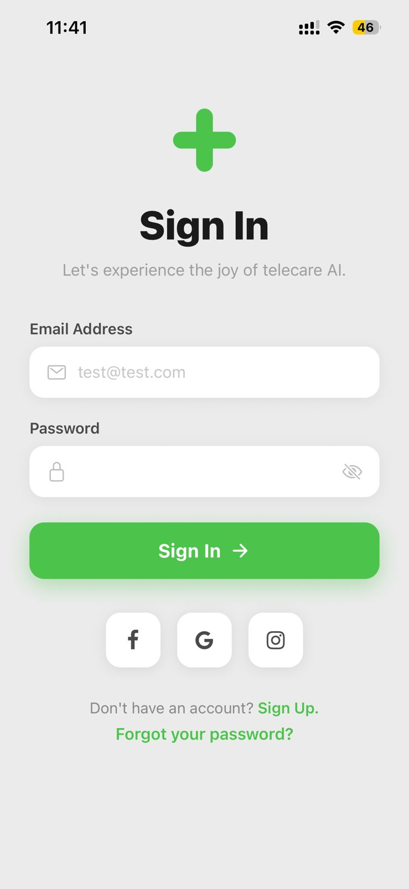

# React Native Sign In Screen

A polished mobile authentication UI built with **React Native** and **Expo**, inspired by the [Osler AI Telehealth App design on Dribbble](https://dribbble.com/shots/24783022-osler-AI-Telehealth-Telemedicine-App-Sign-In-Sign-Up-UI).

---

## App Screenshot



---

## Features

- App logo (green medical cross)
- Bold heading and descriptive subheading
- Email address input with icon
- Password input with show/hide toggle
- Green Sign In button with arrow
- Social login buttons (Facebook, Google, Instagram)
- "Sign Up" and "Forgot your password?" text actions

---

## Tech Stack

| Tool                  | Purpose                      |
| --------------------- | ---------------------------- |
| React Native          | Core framework               |
| Expo (Blank template) | Development environment      |
| @expo/vector-icons    | Ionicons & FontAwesome icons |

---

## Project Structure

```
React-Native-Sign-screen/
├── App.js                  # Entry point
├── screens/
│   └── SignInScreen.js     # Main sign-in screen component
├── assets/                 # App icons & splash
├── app.json                # Expo config
└── package.json
```

---

## Getting Started

```bash
# Install dependencies
npm install

# Start Expo dev server
npx expo start
```

Then press:

- `a` — open on Android emulator
- `i` — open on iOS simulator (macOS only)
- Scan the QR code with **Expo Go** on your phone

---

## Design Reference

[Osler AI Telehealth App – Dribbble](https://dribbble.com/shots/24783022-osler-AI-Telehealth-Telemedicine-App-Sign-In-Sign-Up-UI)
